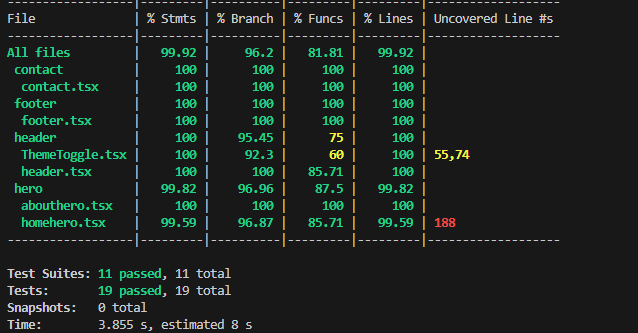

# Desafio Lacrei Saúde

Este repositório contém a aplicação web desenvolvida como parte do desafio técnico da Lacrei Saúde. A proposta do projeto é entregar uma interface acessível, responsiva e com foco em performance e boas práticas.

**Principais objetivos:** interface limpa, formulários acessíveis, imagens otimizadas e suporte a tema claro/escuro (Dark Mode).

## Tecnologias

- Framework: Next.js 16 (App Router)
- Linguagem: TypeScript
- Estilização: styled-components
- Otimização de imagens: `next/image` e formatos modernos (WebP/AVIF)
- Qualidade de código: ESLint

## Rodando o projeto localmente

### Pré-requisitos

- Node.js 18+ recomendado
- npm (ou use `pnpm`/`yarn` conforme sua preferência)

### Passos

1. Clone o repositório:

```bash
git clone <URL-do-seu-repositório>
```

2. Entre na pasta do projeto:

```bash
cd desafio-lacrei-saude
```

3. Instale as dependências:

```bash
npm install
```

4. Rode em modo de desenvolvimento:

```bash
npm run dev
```

5. Abra no navegador: http://localhost:3000

### Build e produção local

Gerar build:

```bash
npm run build
```

Servir a versão de produção localmente:

```bash
npm start
```

## Scripts úteis

- `npm run dev` — servidor de desenvolvimento
- `npm run build` — gerar build de produção
- `npm start` — servir build de produção
- `npm run lint` — rodar ESLint

## Sobre o Dark Mode

Este projeto oferece suporte a Dark Mode com um componente de alternância no cabeçalho (`ThemeToggle`). Principais pontos:

- O toggle altera o tema aplicando atributos/variáveis de CSS que existem em `lib/Globalstyles.ts` (ex.: `html[data-theme="dark"]`).
- As cores para os dois temas (claro/escuro) são controladas por variáveis CSS, o que facilita manter contraste e acessibilidade.
- Para testar manualmente o dark mode, abra o console do navegador e execute:

```js
document.documentElement.setAttribute('data-theme', 'dark')
// para voltar ao claro:
document.documentElement.removeAttribute('data-theme')
```

- O `ThemeToggle` no header também aciona essa mudança (e pode ser estendido para persistência em localStorage, se desejado).

## Acessibilidade e Boas Práticas

- Uso de tags semânticas e atributos `aria` nos componentes principais.
- Foco visível e controles navegáveis por teclado.
- Imagens tratadas com `next/image` para lazy-loading/otimização (quando aplicável).


## Deploy

https://desafio-lacrei-saude-uwsd.vercel.app/


## Resultado Lighthouse


https://pagespeed.web.dev/analysis/https-desafio-lacrei-saude-uwsd-vercel-app/hmcyr3dydw?hl=pt&form_factor=mobile

## Registros de Testes

- Unitários (Jest): testes dos componentes e hooks principais. Como rodar: `npm test`. Todos os testes do repositório passam — veja a pasta `coverage/` para detalhes.
- Comportamento (React Testing Library): casos para `Header`, `Footer`, `Contact` e `Hero` (`app/components/**/*.test.tsx`), cobrindo renderização, acessibilidade básica e o toggle de tema.
- Acessibilidade: verificação manual de navegação por teclado e leitores de tela (NVDA/VoiceOver), além de checagem de contraste com Axe/Lighthouse. Ajustes aplicados onde faltava semântica ou labels.
- Responsividade: testes no DevTools para mobile/tablet/desktop; o layout se mantém legível nos pontos de quebra adotados.
- Performance: auditoria em build de produção (`npm run build && npm start`) com foco em otimização de imagens 
- Cross-browser: verificado em Chrome, Firefox e Edge — comportamentos principais alinhados.


## Justificativas Visuais

- Contraste e legibilidade: paleta e tipografia pensadas para leitura confortável em ambos os temas.
- Dark Mode: implementado via `data-theme` e variáveis CSS para manter consistência entre temas.
- Estados de foco: visualização clara do foco para usuários de teclado.
- Responsividade: prioridades visuais mantidas em telas menores.

## Resultados dos Testes



## Estratégia de Rollback

Caso uma nova versão apresente problemas em produção, existem duas estratégias principais para reverter as alterações.

1. Rollback Instantâneo (Recomendado - Via Vercel)
Esta é a forma mais rápida de restaurar o serviço, pois não requer novo build.

Acesse o dashboard do projeto na Vercel.
Vá até a aba "Deployments".
Localize o deploy anterior que estava estável (marcado como "Ready").
Clique no menu de opções (três pontos) e selecione "Instant Rollback".
A versão anterior será promovida a produção imediatamente.


2. Rollback via Código (Via Git)
Utilize este método se precisar corrigir o histórico do repositório.

Identifique o hash do commit estável anterior:
git log --oneline
Crie um novo commit que reverte as alterações problemáticas:
git revert <hash-do-commit-problematico>
Envie a alteração para a branch main:
git push origin main
O pipeline da Vercel detectará o novo commit e fará o deploy da versão corrigida.